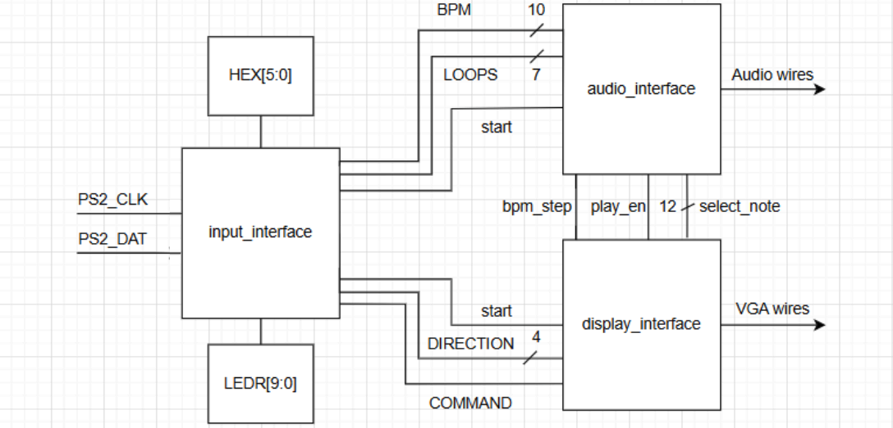
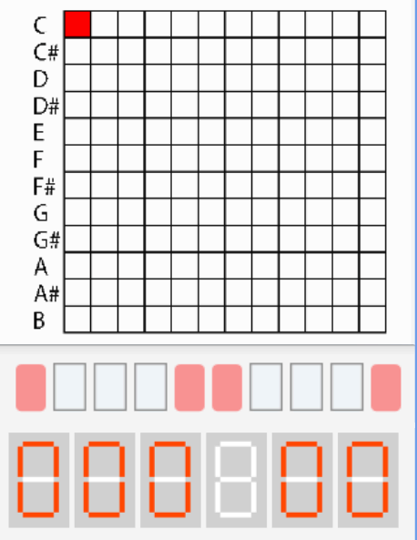
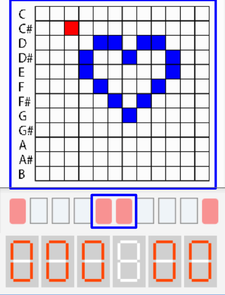
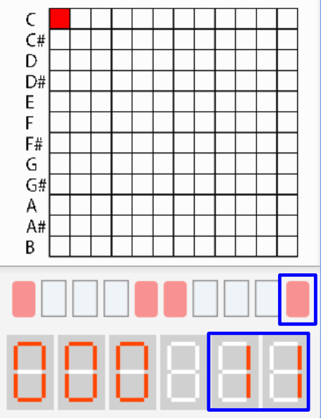
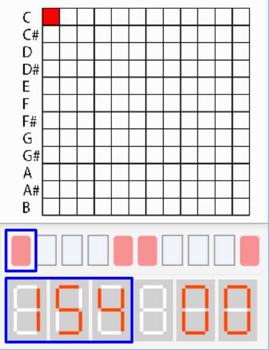
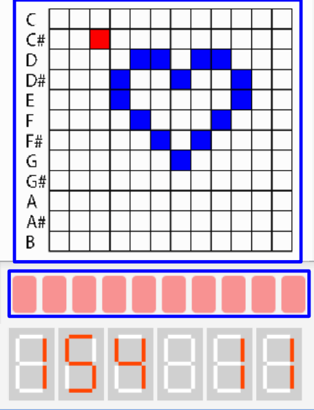

# Step Sequencer

A digital music step sequencer implemented on the DE1-SoC FPGA. 

## Block Diagram

## Overview

### UI Display (Grid Interface)
- 12x12 interactive note grid representing the middle C octave.
- Visual cursor for navigation in **Move Mode**.
- Active note highlighting for saved patterns.

### Audio Engine
- 512x16 Sine Look-Up Table (ROM) acting as a Numerically Controlled Oscillator (NCO).
- Polyphony logic that sums digital sine values and performs a 1-bit right shift to manage volume and prevent clipping.
- Real-time 16-bit signed audio output.

### Interaction
- Fully controlled via PS/2 Keyboard.
- Visual feedback through VGA, HEX displays, and onboard LEDs.

## System States & Modes

The synthesizer operates as a Finite State Machine (FSM) centered around an **IDLE** state.

### 1. IDLE Mode (Default)
The starting point for all navigation.
- `Space` → Enter **Play Mode**.
- `M` → Enter **Move Mode**.
- `L` → Enter **Loops Mode**.
- `B` → Enter **BPM Mode**.

### 2. Move Mode
Used to program the 12x12 sequencer grid.
- **Visuals:** `LEDR[5:4]` flashes.
- `W / A / S / D` → Move the cursor across the grid.
- `Space` → Toggle the selected square on/off.
- `Enter` → Confirm changes and return to IDLE.

### 3. Loops Mode
Sets the number of times the sequence will repeat.
- **Visuals:** `LEDR[0]` flashes; `HEX[1:0]` displays the current loop count.
- **Input:** Use `0-9` and `Backspace` to input values.
- `Enter` → Confirm and return to IDLE.

### 4. BPM Mode
Sets the playback speed of the sequencer.
- **Visuals:** `LEDR[9]` flashes; `HEX[5:3]` displays the current BPM.
- **Input:** Use `0-9` and `Backspace` to input values.
- `Enter` → Confirm and return to IDLE.

### 5. Play Mode
Starts the audio sequence.
- **Visuals:** `LEDR[9:0]` turn on.
- **Constraint:** Will only trigger if BPM is set to a non-zero value.
- Plays the 12x12 grid patterns based on the established BPM and Loop count.

## Control Functions Summary
- `KEY[0]` → Hardware Reset (Clears grid and resets FSM to IDLE).
- `Backspace` → Clear digit input in BPM/Loops modes.
- `Enter` → State confirmation.

## Bugs & Issues
- **Audio Ringing:** High-frequency artifacts occur when summing multiple notes; likely due to phase misalignment in the summation logic.
- **Precision Loss:** Clock division for specific musical frequencies causes slight tuning inaccuracies in higher octaves.